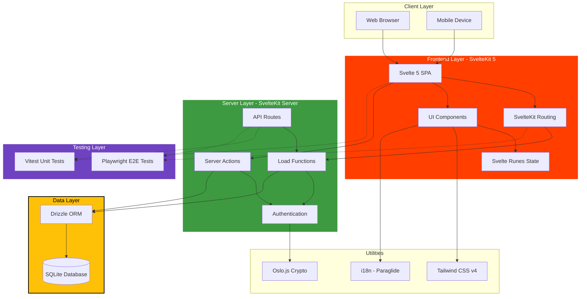
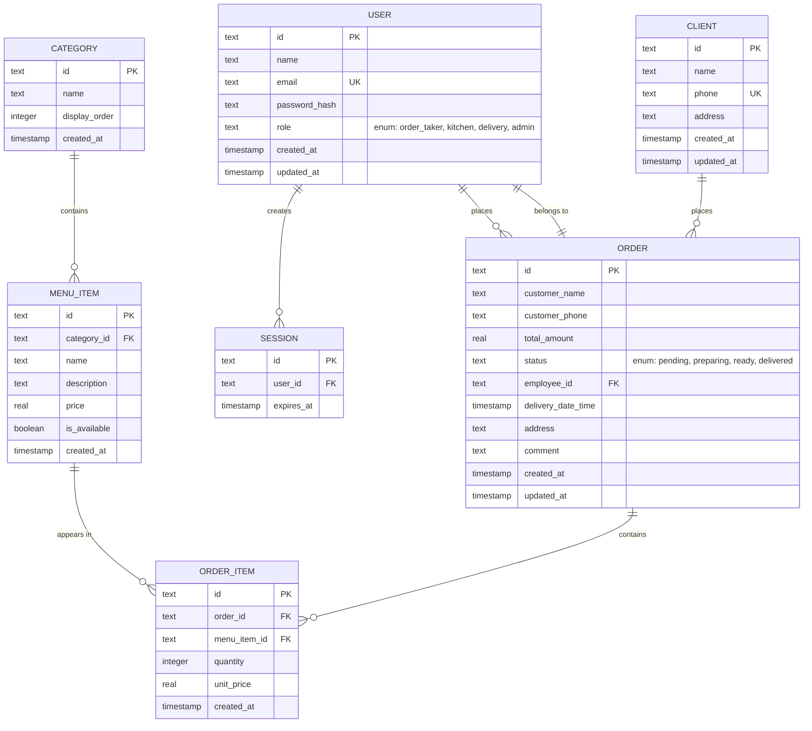
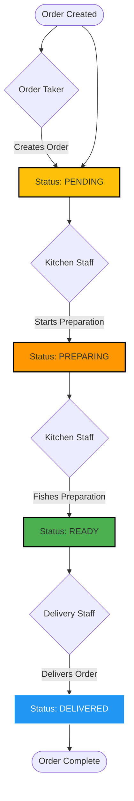
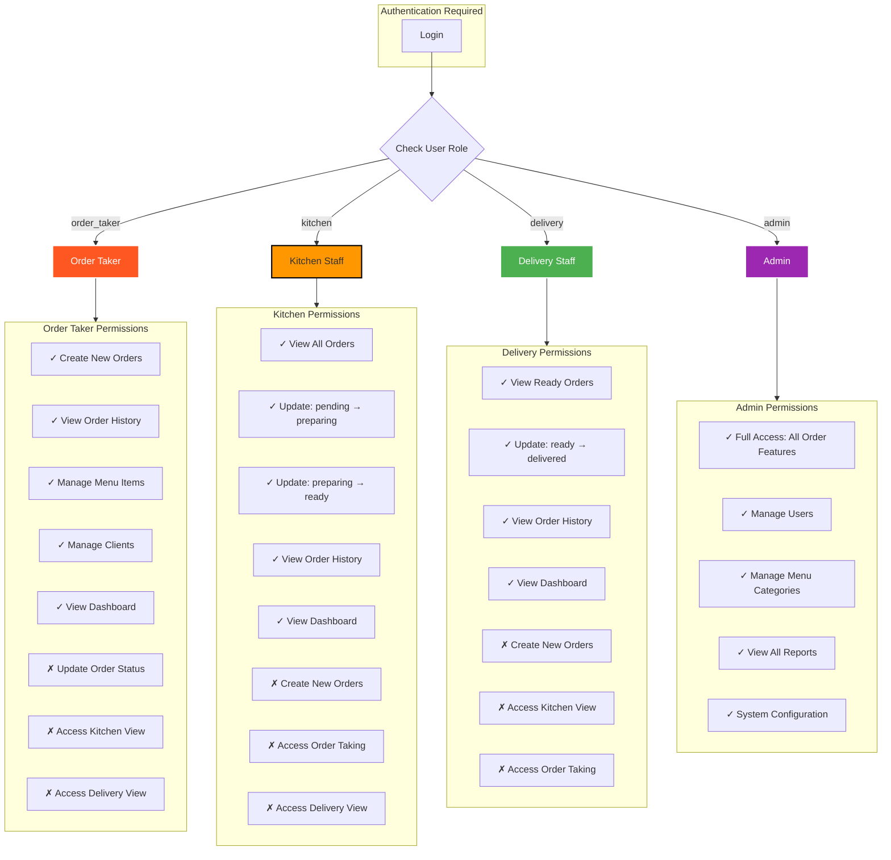
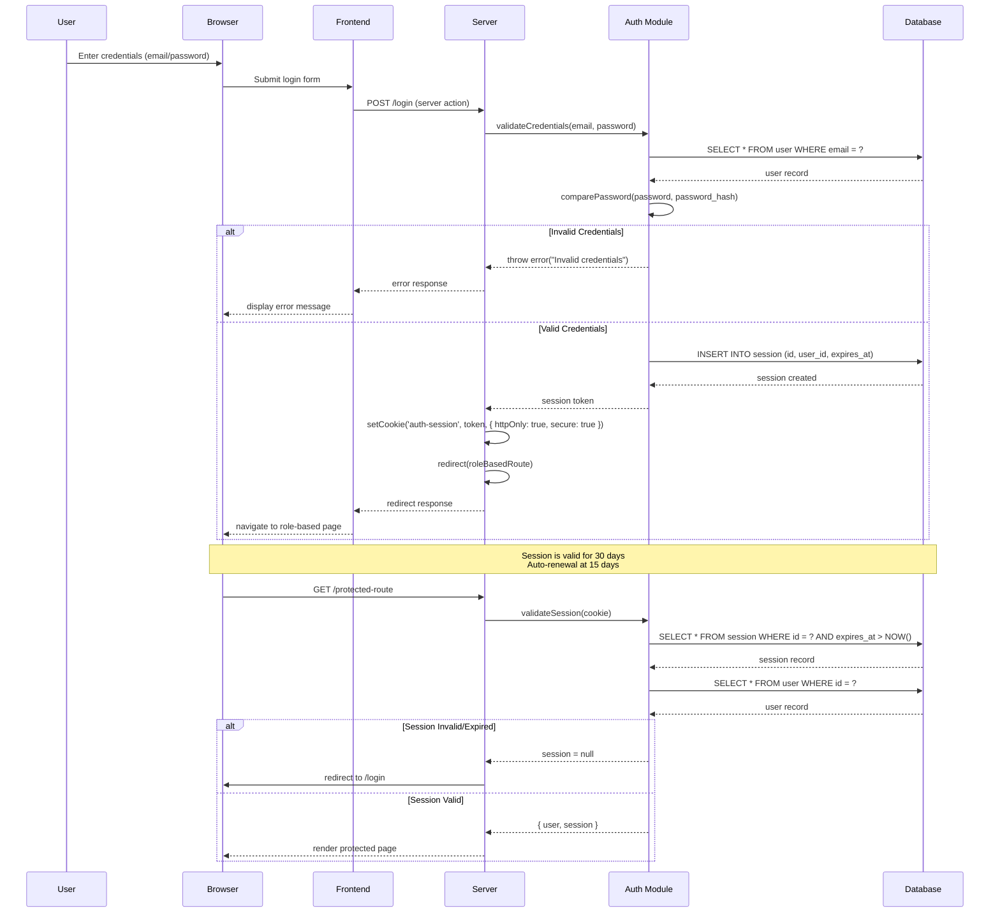
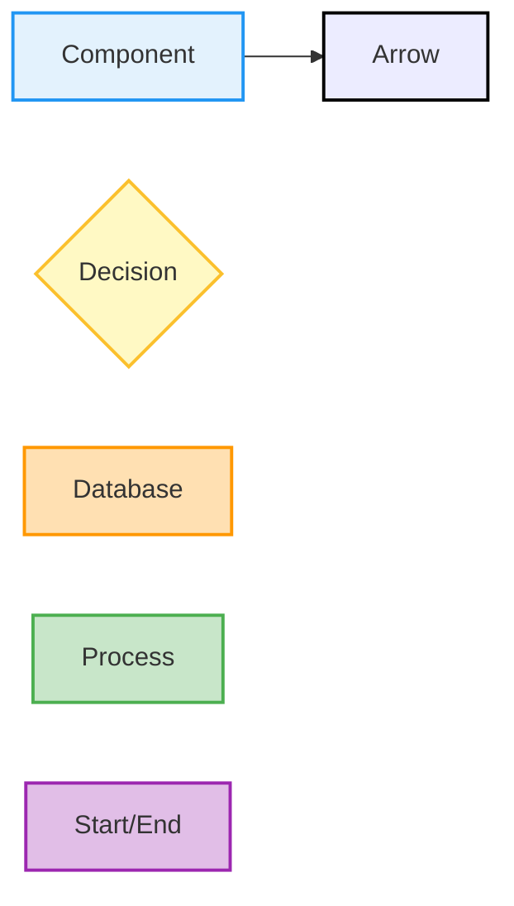

# Restaurant Ordering System - Architecture Diagrams

This document provides comprehensive visual documentation of the Restaurant Ordering System architecture, database schema, workflows, and user roles.

---

## 1. System Architecture Diagram

The system follows a modern full-stack architecture with clear separation of concerns:

**Architecture Overview:**
- **Client Layer**: Browser and mobile devices access the application
- **Frontend Layer**: SvelteKit 5 with Svelte 5 runes for reactive state management
- **Server Layer**: Server-side rendering, API routes, and authentication
- **Data Layer**: SQLite database accessed through Drizzle ORM
- **Utilities**: i18n, styling, and crypto libraries
- **Testing Layer**: Vitest for unit tests, Playwright for E2E tests

---

## 2. Database Schema ERD

The database consists of 7 tables with relationships supporting the full order lifecycle:

**Table Descriptions:**
- **USER**: Staff accounts with role-based permissions (order_taker, kitchen, delivery, admin)
- **SESSION**: Authentication sessions with 30-day expiry
- **CATEGORY**: Menu categories for organizing items (Bakery, Beverages, etc.)
- **MENU_ITEM**: Individual menu items with pricing and availability
- **ORDER**: Order headers containing customer info and status
- **ORDER_ITEM**: Line items linking orders to menu items with quantities and prices
- **CLIENT**: Customer database with phone-based lookup

**Key Relationships:**
- One user can have multiple sessions
- One user can place multiple orders
- One category can contain multiple menu items
- One menu item can appear in multiple order items
- One order can contain multiple order items
- One order belongs to one employee (user)
- One client can place multiple orders

---

## 3. Order Flowchart

Orders progress through a defined lifecycle from creation to delivery:

**Order Status Flow:**
1. **PENDING** (Yellow): Order created by order taker, awaiting kitchen attention
2. **PREPARING** (Orange): Kitchen staff has started preparing the order
3. **READY** (Green): Order is ready for delivery
4. **DELIVERED** (Blue): Delivery completed, order closed

**Role Responsibilities:**
- **Order Taker**: Creates orders (PENDING status)
- **Kitchen**: Updates PENDING → PREPARING → READY
- **Delivery**: Updates READY → DELIVERED

---

## 4. User Roles & Permissions

The system implements role-based access control with four distinct roles:

**Role-Based Access Control:**

| Role | Dashboard | Orders | Kitchen | Delivery | Admin |
|------|-----------|--------|---------|----------|-------|
| **Order Taker** | ✓ | ✓ (create, view) | ✗ | ✗ | ✗ |
| **Kitchen** | ✓ | ✓ (view, status: pending→ready) | ✓ | ✗ | ✗ |
| **Delivery** | ✓ | ✓ (view, status: ready→delivered) | ✗ | ✓ | ✗ |
| **Admin** | ✓ | ✓ (full access) | ✓ | ✓ | ✓ |

**Default Route Redirects:**
- Order Taker: `/orders/new`
- Kitchen: `/kitchen`
- Delivery: `/delivery`
- Admin: `/admin`

---

## 5. Authentication Flow

The authentication system uses session-based tokens with secure cookie storage:

**Authentication Mechanism:**
1. **Login**: Users submit credentials via login form
2. **Validation**: Server validates email and password hash
3. **Session Creation**: New session created in database with 30-day expiry
4. **Cookie Storage**: Session token stored as HTTP-only, secure cookie
5. **Route Protection**: Protected routes validate session on every request
6. **Auto-Renewal**: Sessions automatically renewed 15 days before expiry

**Security Features:**
- Passwords hashed before storage
- Session tokens stored as HTTP-only cookies (not accessible to JavaScript)
- Secure flag enabled (HTTPS only in production)
- Sessions cascade-deleted from database on logout
- Role-based redirects prevent unauthorized access

**Logout Flow:**

---

## Technical Implementation Notes

### Session Management
- **Session Table**: Stores session IDs with user references and expiry timestamps
- **Cookie Configuration**: HTTP-only, secure, same-site strict
- **Expiry**: 30 days from creation, auto-renewal at 15 days

### Route Protection
- **Protected Routes**: All routes under `(app)/` require valid session
- **Public Routes**: `(auth)/` group contains login/logout pages
- **Middleware**: Root layout server handles authentication checks

### Database Relationships
- **Foreign Keys**: All foreign keys properly defined with cascade deletes
- **Indexes**: Email and phone columns have unique constraints
- **Enums**: Role and status fields use SQLite text with enum constraints

### Tech Stack Integration
- **SvelteKit 5**: Server actions for form handling, load functions for data fetching
- **Drizzle ORM**: Type-safe database queries with migrations
- **SQLite**: Embedded database for easy deployment
- **Oslo.js**: Crypto utilities for session token generation

---

## Diagram Legend

- **Rectangle**: Process, component, or entity
- **Arrow**: Flow direction or relationship
- **Diamond**: Decision point or conditional
- **Cylinder**: Database or data storage
- **Oval/Rounded Rect**: Start or end point

---

## Additional Resources

For more detailed information, refer to:
- [README.md](../README.md) - Project overview and getting started
- [AGENTS.md](../AGENTS.md) - Development guidelines for agents
- [IMPLEMENTATION_PLAN.md](../plans/IMPLEMENTATION_PLAN.md) - Full implementation roadmap

---

*Last updated: January 2026*
